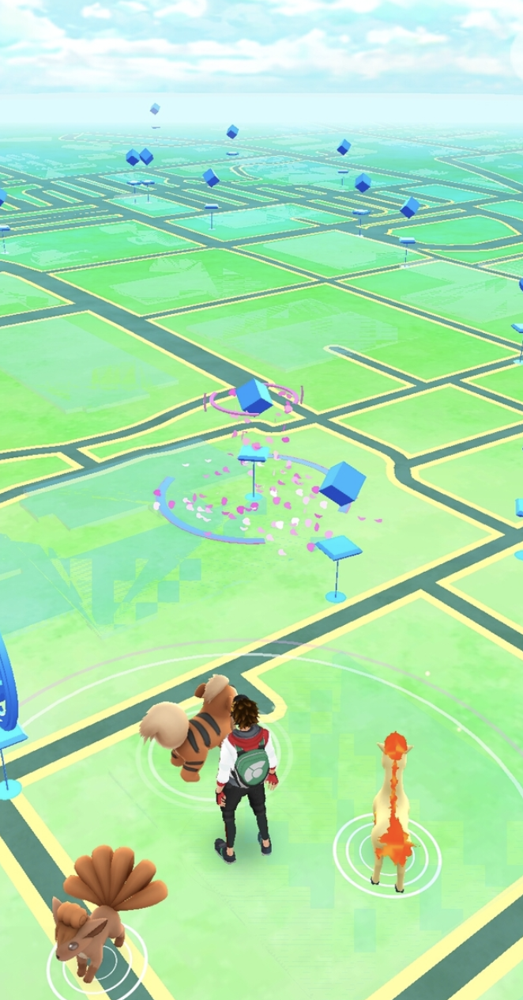
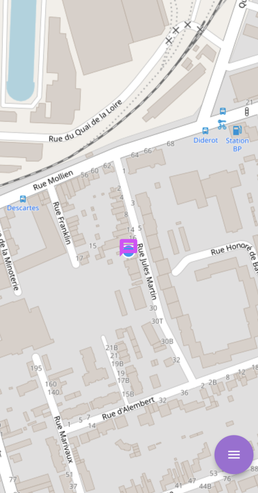
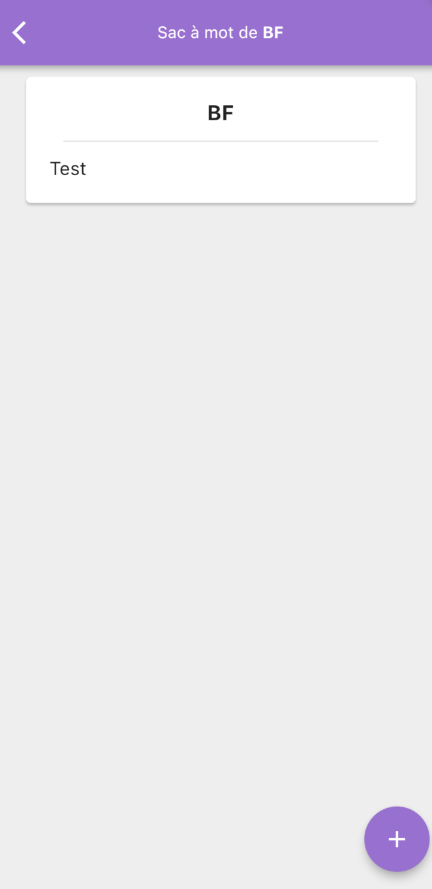
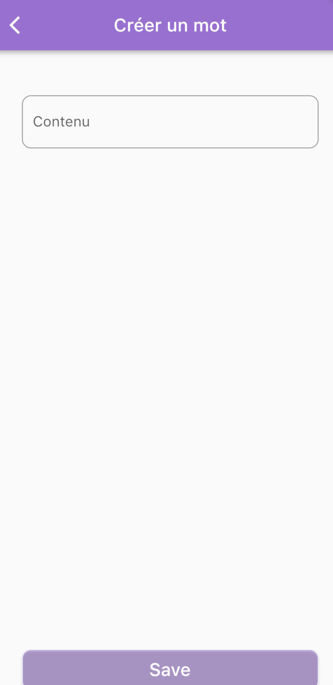

# Littlewords School Project

## Authors

Benjamin TROLAIS
Paul DELACRE
Maxime VAN EYGEN

## Description

Littlewords is a school project in group of 3 people that we realized during our 3rd year of computer science degree.

It's a game where you have to find words around you like in the game Pokemon Go.

|               Pokemon Go               |               Littlewords                |
| :------------------------------------: | :--------------------------------------: |
|  |  |

Words that you find are added to your bag and you can throw them to another place where other players can find them.

You can also create your own words and throw them on the map.

## Installation

### Requirements

- Flutter
- Android Studio
- Android SDK
- Android Emulator

### Installation

- Clone the repository
- Open the project in Android Studio
- Run the project

Thanks for reading, have fun !

### Instructions for the teacher

## Webservices

- [x] **GET** Back is up (done)

- [ ] **POST** Word (not working)

- [ ] **PUT** Word (not working)

- [ ] **GET** Word (not working)

- [x] **GET** All words (done)

## Requirements

- [x] Words are stored in a database (Sqlite)
- [x] Use Riverpod for state management
- [x] Use Dio for http requests
- [x] Use Hive for local storage
- [ ] Import and use custom fonts
- [ ] Import and use images
